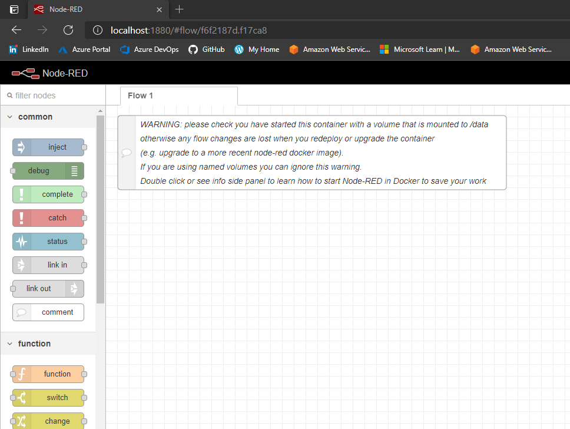

# Terraform and Docker

These are my notes for Section 2 of the *More than Certified in Terraform** course.

## The terraform block

- I used the `"kreuzwerker/docker"` source for the required provider, since this is the one required for Terraform version 0.14, the one I'm running.
- I specified the version `"2.11.0"`, which is the latest, at time of writing.

## The provider block

- Here, I encountered a problem. I ran `terraform plan` without any parameters and I got the following error:

```
Error: Error initializing Docker client: protocol not available

  on main.tf line 10, in provider "docker":
  10: provider "docker" {
```

- I searched this error and the workaround I found was to set the `host` inside the provider block.
- I used this value: `host = "npipe:////.//pipe//docker_engine"`
- It worked correctly.

## The Docker container

- I successfully deployed the Docker container and verified it's running with the command `docker ps`.
- I'm working in my local machine, so I accessed the newly created container in the `localhost:1880` address.
- I tried to access with the container's IP address, but I couldn't.
- This is the command I ran to obtain the container's IP address: `docker inspect --format '{{ .NetworkSettings.IPAddress }}' nodered`, where `nodered` is the name of the container.


## Terraform State

- The Terraform State file is basically the description of all the resources you have deployed.
- `"serial"` is updated every time there's an update within the state. A higher number indicates a newer version of the state file.
- The `terraform.tfstate.backup` file represents the last state file.
- To see a nicely formatted output of the Terraform State file, we can use a tool called [JQ](https://stedolan.github.io/jq/), a lightweight command-line JSON processor.
- To install JQ, I used Chocolatey: `choco install jq`.
- We can run the command `terraform show -json | jq` to see the state file directly in the command line.
- `terraform state list` shows a list of the resources present in the state file.
- To look for specific data in the Terraform state file:
  - On Linux: `terraform show | grep name`
  - On PowerShell: `terraform show | Select-String -Pattern name`
